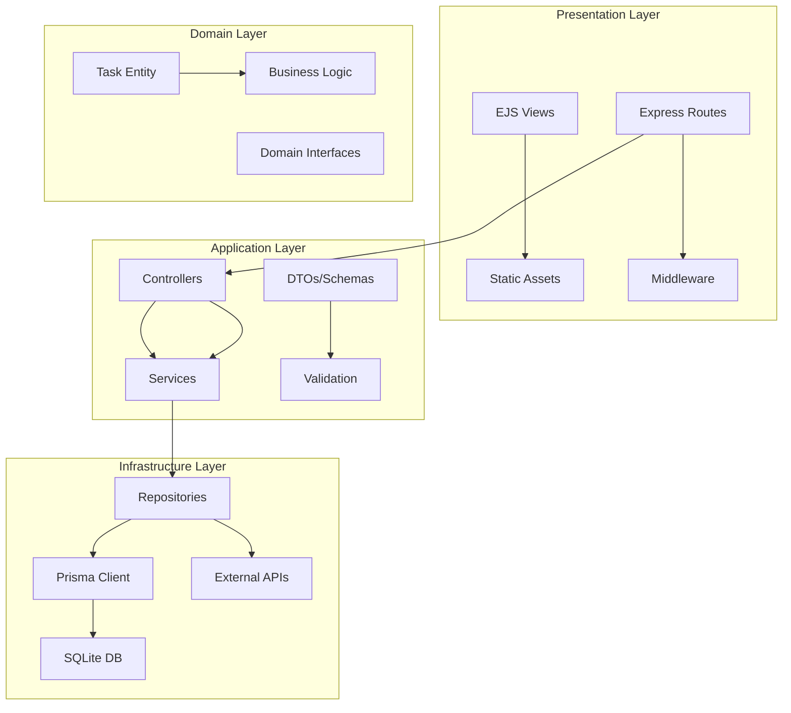
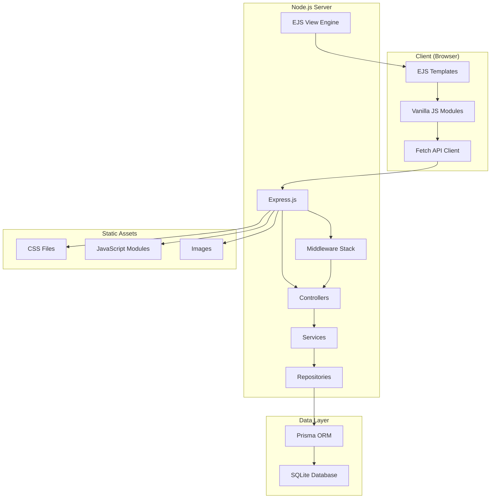
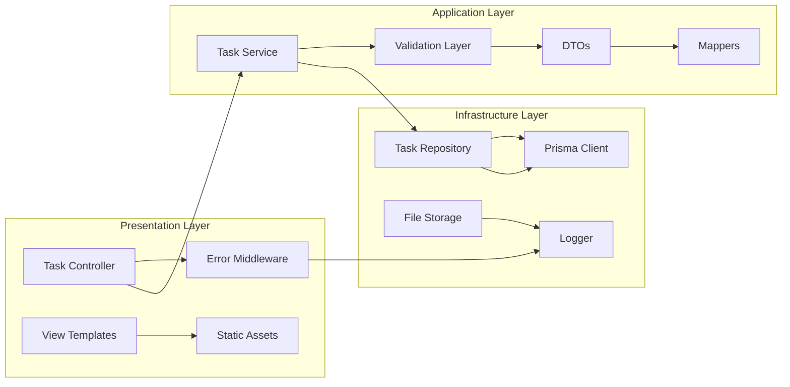
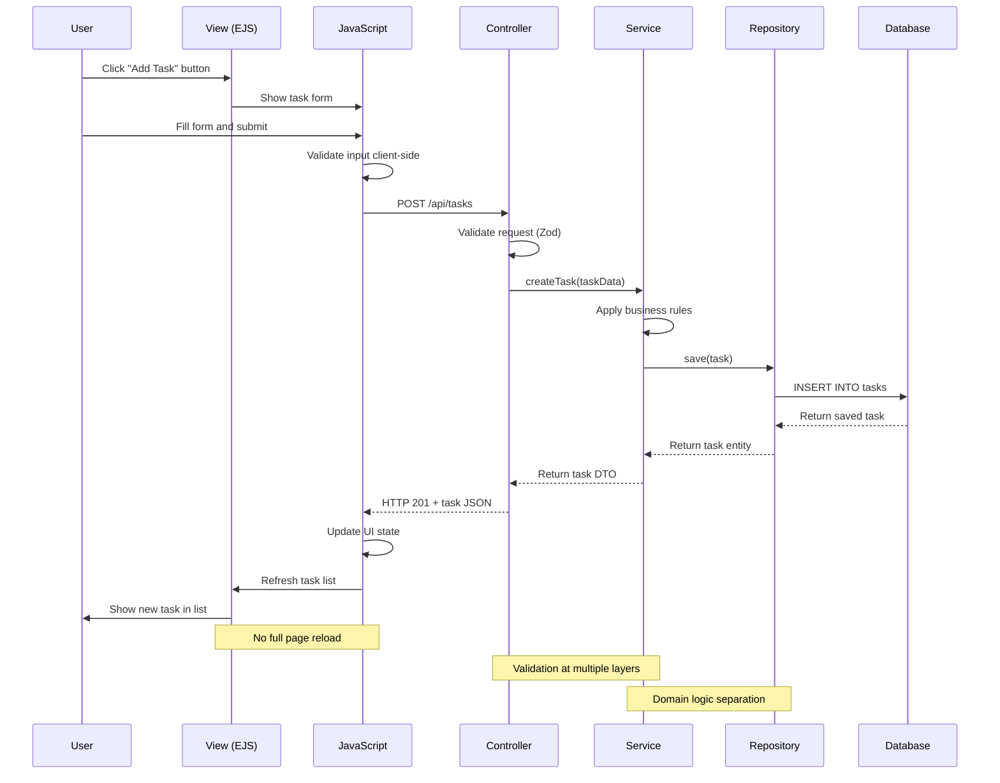

# Todo App MVP - Technical Design & Architecture

## Overview
**Project**: Simple Todo App MVP  
**Architecture**: Node.js + Express + SQLite + Vanilla JavaScript  
**Target**: Individual users, single-instance deployment  
**Design Date**: February 3, 2026

---

## 1. Technology Stack & Rationale

### Backend Stack
- **Runtime**: Node.js 20 LTS (Long-term support, excellent performance)
- **Framework**: Express.js 4.19+ (Lightweight, mature, extensive ecosystem)
- **Database**: SQLite 3 with better-sqlite3 driver (Zero-config, file-based, perfect for MVP)
- **ORM**: Prisma ORM (Type-safe, excellent DX, migration support)
- **Validation**: Zod (TypeScript-first validation, runtime safety)
- **Logging**: Winston (Structured logging, multiple transports)
- **Testing**: Vitest (Fast, modern test runner) + Supertest (HTTP assertion)

### Frontend Stack
- **Views**: Express + EJS templates (Server-side rendering, progressive enhancement)
- **Styling**: CSS3 with PostCSS (Modern CSS features, autoprefixer)
- **JavaScript**: Vanilla ES2022 modules (No build complexity for MVP)
- **HTTP Client**: Native Fetch API with custom wrapper
- **Build**: Vite for development (Fast HMR, ES modules)

### Development Tools
- **Language**: TypeScript (Type safety, better DX)
- **Linting**: ESLint + Prettier (Code quality, formatting)
- **Process Manager**: PM2 (Production process management)
- **Environment**: dotenv (Configuration management)

### Rationale
1. **Node.js**: Single language for full stack, excellent async I/O for web apps
2. **SQLite**: Zero-config database, easy deployment, sufficient for MVP scale
3. **Prisma**: Type-safe database access, excellent migrations, introspection
4. **Vanilla JS**: No framework complexity, faster initial load, easier debugging
5. **EJS**: Simple templating, server-side rendering for better SEO/accessibility

---

## 2. Architecture & Layering

### Layer Structure


### Layer Responsibilities

#### Presentation Layer (`src/presentation/`)
- **Express Routes**: HTTP endpoint definitions and routing
- **Controllers**: Request/response handling, input validation
- **Views**: EJS templates for server-side rendering
- **Middleware**: Authentication, error handling, logging
- **Static Assets**: CSS, JavaScript, images

#### Application Layer (`src/application/`)
- **Services**: Business logic orchestration, transaction management
- **DTOs**: Data transfer objects for API contracts
- **Validators**: Input validation schemas (Zod)
- **Interfaces**: Service contracts and abstractions

#### Domain Layer (`src/domain/`)
- **Entities**: Core business objects (Task, User)
- **Value Objects**: Immutable domain concepts (Priority, Status)
- **Domain Services**: Pure business logic
- **Repositories**: Data access interfaces

#### Infrastructure Layer (`src/infrastructure/`)
- **Repositories**: Concrete data access implementations
- **Database**: Prisma client configuration
- **External Services**: File system, email, etc.
- **Configuration**: Environment and app settings

### Dependency Injection Strategy
```typescript
// Simple dependency container using native ES6 classes
class Container {
  private services = new Map();
  
  register<T>(key: string, factory: () => T): void {
    this.services.set(key, factory);
  }
  
  resolve<T>(key: string): T {
    const factory = this.services.get(key);
    return factory ? factory() : null;
  }
}

// Bootstrap dependencies
const container = new Container();
container.register('taskRepository', () => new PrismaTaskRepository(prisma));
container.register('taskService', () => new TaskService(container.resolve('taskRepository')));
```

---

## 3. Component Breakdown

### Backend Components

#### Controllers (`src/presentation/controllers/`)
```typescript
// taskController.ts
export class TaskController {
  constructor(private taskService: TaskService) {}
  
  async getTasks(req: Request, res: Response) {
    const filters = TaskFiltersSchema.parse(req.query);
    const result = await this.taskService.getTasks(filters);
    res.json(result);
  }
  
  async createTask(req: Request, res: Response) {
    const taskData = CreateTaskSchema.parse(req.body);
    const task = await this.taskService.createTask(taskData);
    res.status(201).json(task);
  }
}
```

#### Services (`src/application/services/`)
```typescript
// taskService.ts
export class TaskService {
  constructor(private taskRepository: TaskRepository) {}
  
  async getTasks(filters: TaskFilters): Promise<PaginatedResult<Task>> {
    // Business logic: apply filters, pagination, sorting
    const tasks = await this.taskRepository.findMany(filters);
    const total = await this.taskRepository.count(filters);
    
    return {
      data: tasks,
      pagination: {
        page: filters.page,
        limit: filters.limit,
        total,
        pages: Math.ceil(total / filters.limit)
      }
    };
  }
}
```

#### Repositories (`src/infrastructure/repositories/`)
```typescript
// taskRepository.ts
export class PrismaTaskRepository implements TaskRepository {
  constructor(private prisma: PrismaClient) {}
  
  async findMany(filters: TaskFilters): Promise<Task[]> {
    return this.prisma.task.findMany({
      where: {
        deletedAt: null,
        title: filters.search ? { contains: filters.search } : undefined,
        priority: filters.priority || undefined,
        completed: filters.status === 'completed' ? true : 
                   filters.status === 'incomplete' ? false : undefined
      },
      orderBy: { [filters.sortBy]: filters.sortOrder },
      skip: (filters.page - 1) * filters.limit,
      take: filters.limit
    });
  }
}
```

#### Middleware (`src/presentation/middleware/`)
```typescript
// errorHandler.ts
export const errorHandler = (err: Error, req: Request, res: Response, next: NextFunction) => {
  const problemDetails = {
    type: 'https://httpstatuses.com/500',
    title: 'Internal Server Error',
    status: 500,
    detail: err.message,
    instance: req.path,
    traceId: req.headers['x-correlation-id']
  };
  
  logger.error('Request failed', { error: err, traceId: problemDetails.traceId });
  res.status(500).json(problemDetails);
};
```

### Frontend Components

#### JavaScript Modules (`public/js/`)
```typescript
// api.js - HTTP client wrapper
export class ApiClient {
  private baseUrl: string;
  
  async get(endpoint: string, params = {}) {
    const url = new URL(endpoint, this.baseUrl);
    Object.entries(params).forEach(([key, value]) => 
      url.searchParams.append(key, String(value))
    );
    
    const response = await fetch(url);
    if (!response.ok) throw new ApiError(await response.json());
    return response.json();
  }
  
  async post(endpoint: string, data = {}) {
    const response = await fetch(new URL(endpoint, this.baseUrl), {
      method: 'POST',
      headers: { 'Content-Type': 'application/json' },
      body: JSON.stringify(data)
    });
    
    if (!response.ok) throw new ApiError(await response.json());
    return response.json();
  }
}
```

---

## 4. Data Model & Persistence

### Database Schema
```prisma
// schema.prisma
model Task {
  id          String    @id @default(cuid())
  title       String    @db.VarChar(200)
  description String?   @db.Text
  priority    Priority  @default(MEDIUM)
  completed   Boolean   @default(false)
  dueDate     DateTime?
  tags        String?   // JSON array for MVP simplicity
  
  // Audit fields
  createdAt   DateTime  @default(now())
  updatedAt   DateTime  @updatedAt
  deletedAt   DateTime? // Soft delete
  version     Int       @default(1) // Optimistic concurrency
  
  @@index([deletedAt]) // Query filter index
  @@index([priority, dueDate]) // Common filter combination
  @@index([createdAt]) // Default sort
}

enum Priority {
  LOW
  MEDIUM
  HIGH
}
```

### Entity Configuration
```typescript
// Task entity with business logic
export class Task {
  constructor(
    public id: string,
    public title: string,
    public description: string | null = null,
    public priority: Priority = Priority.MEDIUM,
    public completed: boolean = false,
    public dueDate: Date | null = null,
    public tags: string[] = [],
    public createdAt: Date = new Date(),
    public updatedAt: Date = new Date(),
    public deletedAt: Date | null = null,
    public version: number = 1
  ) {
    this.validate();
  }
  
  private validate(): void {
    if (!this.title?.trim()) {
      throw new ValidationError('Task title is required');
    }
    if (this.title.length > 200) {
      throw new ValidationError('Task title must be 200 characters or less');
    }
  }
  
  markCompleted(): void {
    this.completed = true;
    this.updatedAt = new Date();
    this.version++;
  }
  
  isOverdue(): boolean {
    return this.dueDate ? this.dueDate < new Date() && !this.completed : false;
  }
  
  softDelete(): void {
    this.deletedAt = new Date();
    this.updatedAt = new Date();
    this.version++;
  }
}
```

### Migration Strategy
```typescript
// migrations/001_initial.ts
import { Prisma } from '@prisma/client';

export const up: Prisma.MigrationScript = `
CREATE TABLE Task (
  id TEXT PRIMARY KEY,
  title VARCHAR(200) NOT NULL,
  description TEXT,
  priority TEXT NOT NULL DEFAULT 'MEDIUM',
  completed BOOLEAN NOT NULL DEFAULT 0,
  dueDate DATETIME,
  tags TEXT,
  createdAt DATETIME NOT NULL DEFAULT CURRENT_TIMESTAMP,
  updatedAt DATETIME NOT NULL DEFAULT CURRENT_TIMESTAMP,
  deletedAt DATETIME,
  version INTEGER NOT NULL DEFAULT 1
);

CREATE INDEX idx_task_deletedAt ON Task(deletedAt);
CREATE INDEX idx_task_priority_dueDate ON Task(priority, dueDate);
CREATE INDEX idx_task_createdAt ON Task(createdAt);
`;
```

### PostgreSQL Migration Path
```typescript
// Future: PostgreSQL configuration
const postgresConfig = {
  datasource: {
    provider: "postgresql",
    url: env("DATABASE_URL")
  },
  // JSON column for tags instead of TEXT
  // UUID for primary keys
  // Proper TIMESTAMP types
};
```

---

## 5. API Design & Documentation

### REST API Conventions
- **Resource-based URLs**: `/api/tasks`, `/api/tasks/{id}`
- **HTTP methods**: GET (read), POST (create), PATCH (update), DELETE (soft delete)
- **Status codes**: 200 (success), 201 (created), 400 (bad request), 404 (not found), 500 (server error)
- **Content-Type**: `application/json` for API endpoints
- **Error format**: RFC7807 ProblemDetails

### API Endpoints

#### Task Management
```yaml
/api/tasks:
  get:
    summary: List tasks with filtering, sorting, and pagination
    parameters:
      - name: page
        in: query
        schema: { type: integer, default: 1 }
      - name: limit
        in: query
        schema: { type: integer, default: 25, maximum: 100 }
      - name: search
        in: query
        schema: { type: string }
      - name: priority
        in: query
        schema: { type: string, enum: [LOW, MEDIUM, HIGH] }
      - name: status
        in: query
        schema: { type: string, enum: [completed, incomplete] }
      - name: sortBy
        in: query
        schema: { type: string, enum: [createdAt, dueDate, priority, title] }
      - name: sortOrder
        in: query
        schema: { type: string, enum: [asc, desc], default: desc }
    responses:
      200:
        content:
          application/json:
            schema:
              type: object
              properties:
                data:
                  type: array
                  items: { $ref: '#/components/schemas/Task' }
                pagination:
                  $ref: '#/components/schemas/Pagination'
  
  post:
    summary: Create a new task
    requestBody:
      content:
        application/json:
          schema: { $ref: '#/components/schemas/CreateTaskRequest' }
    responses:
      201:
        content:
          application/json:
            schema: { $ref: '#/components/schemas/Task' }
      400:
        content:
          application/json:
            schema: { $ref: '#/components/schemas/ProblemDetails' }

/api/tasks/{id}:
  patch:
    summary: Update task fields
    parameters:
      - name: id
        in: path
        required: true
        schema: { type: string }
    requestBody:
      content:
        application/json:
          schema: { $ref: '#/components/schemas/UpdateTaskRequest' }
    responses:
      200:
        content:
          application/json:
            schema: { $ref: '#/components/schemas/Task' }
      404:
        content:
          application/json:
            schema: { $ref: '#/components/schemas/ProblemDetails' }
  
  delete:
    summary: Soft delete a task
    responses:
      204: { description: Task deleted }

/api/tasks/{id}/restore:
  post:
    summary: Restore a soft-deleted task
    responses:
      200:
        content:
          application/json:
            schema: { $ref: '#/components/schemas/Task' }
```

### OpenAPI 3.1 Schema Definitions
```yaml
components:
  schemas:
    Task:
      type: object
      properties:
        id: { type: string }
        title: { type: string, maxLength: 200 }
        description: { type: string, nullable: true }
        priority: { type: string, enum: [LOW, MEDIUM, HIGH] }
        completed: { type: boolean }
        dueDate: { type: string, format: date, nullable: true }
        tags: { type: array, items: { type: string } }
        createdAt: { type: string, format: date-time }
        updatedAt: { type: string, format: date-time }
        isOverdue: { type: boolean }
        version: { type: integer }
    
    CreateTaskRequest:
      type: object
      required: [title]
      properties:
        title: { type: string, minLength: 1, maxLength: 200 }
        description: { type: string, maxLength: 1000 }
        priority: { type: string, enum: [LOW, MEDIUM, HIGH], default: MEDIUM }
        dueDate: { type: string, format: date }
        tags: { type: array, items: { type: string }, maxItems: 10 }
    
    UpdateTaskRequest:
      type: object
      properties:
        title: { type: string, minLength: 1, maxLength: 200 }
        description: { type: string, maxLength: 1000 }
        priority: { type: string, enum: [LOW, MEDIUM, HIGH] }
        completed: { type: boolean }
        dueDate: { type: string, format: date }
        tags: { type: array, items: { type: string }, maxItems: 10 }
        version: { type: integer } # Optimistic concurrency
    
    Pagination:
      type: object
      properties:
        page: { type: integer }
        limit: { type: integer }
        total: { type: integer }
        pages: { type: integer }
    
    ProblemDetails:
      type: object
      properties:
        type: { type: string, format: uri }
        title: { type: string }
        status: { type: integer }
        detail: { type: string }
        instance: { type: string }
        traceId: { type: string }
```

---

## 6. UI Architecture (EJS + Vanilla JS)

### View Structure
```
src/
├── views/
│   ├── layouts/
│   │   └── main.ejs           # Base HTML template
│   ├── tasks/
│   │   ├── index.ejs          # Main tasks page
│   │   └── partials/
│   │       ├── task-list.ejs  # Task list component
│   │       ├── task-item.ejs  # Individual task row
│   │       ├── task-form.ejs  # Add/edit task form
│   │       └── filters.ejs    # Filter/search controls
│   └── errors/
│       ├── 404.ejs
│       └── 500.ejs
```

### Main Layout Template
```html
<!-- views/layouts/main.ejs -->
<!DOCTYPE html>
<html lang="en">
<head>
  <meta charset="UTF-8">
  <meta name="viewport" content="width=device-width, initial-scale=1.0">
  <title><%= title %> - Todo App</title>
  <link rel="stylesheet" href="/css/styles.css">
  <meta name="description" content="Simple and efficient todo list management">
</head>
<body>
  <header class="app-header">
    <h1>Todo App</h1>
    <nav>
      <button id="exportBtn" class="btn btn-secondary">Export</button>
      <input type="file" id="importFile" accept=".json" style="display: none;">
      <button id="importBtn" class="btn btn-secondary">Import</button>
    </nav>
  </header>
  
  <main class="app-main" role="main">
    <%- body %>
  </main>
  
  <!-- Toast notifications -->
  <div id="toast-container" aria-live="polite" aria-atomic="true"></div>
  
  <!-- Loading indicator -->
  <div id="loading-indicator" class="loading" style="display: none;">
    <span class="sr-only">Loading...</span>
  </div>
  
  <script type="module" src="/js/app.js"></script>
</body>
</html>
```

### JavaScript Module Architecture
```typescript
// public/js/app.js - Main application entry point
import { ApiClient } from './api.js';
import { TaskManager } from './task-manager.js';
import { UIStateManager } from './ui-state.js';
import { ToastManager } from './toast.js';

class TodoApp {
  constructor() {
    this.api = new ApiClient('/api');
    this.taskManager = new TaskManager(this.api);
    this.uiState = new UIStateManager();
    this.toast = new ToastManager();
    
    this.init();
  }
  
  async init() {
    // Initialize URL state from query params
    this.uiState.loadFromURL();
    
    // Load initial task data
    await this.taskManager.loadTasks(this.uiState.getFilters());
    
    // Setup event listeners
    this.setupEventListeners();
    
    // Setup keyboard shortcuts
    this.setupKeyboardShortcuts();
  }
  
  setupEventListeners() {
    // Task form submission
    document.getElementById('task-form').addEventListener('submit', 
      this.handleTaskSubmit.bind(this));
    
    // Filter changes
    document.getElementById('filters').addEventListener('change', 
      this.handleFiltersChange.bind(this));
    
    // Search input with debouncing
    const searchInput = document.getElementById('search');
    let searchTimeout;
    searchInput.addEventListener('input', (e) => {
      clearTimeout(searchTimeout);
      searchTimeout = setTimeout(() => {
        this.handleSearchChange(e.target.value);
      }, 300);
    });
  }
  
  async handleTaskSubmit(event) {
    event.preventDefault();
    const formData = new FormData(event.target);
    
    try {
      const task = await this.taskManager.createTask(Object.fromEntries(formData));
      this.toast.show('Task created successfully', 'success');
      event.target.reset();
    } catch (error) {
      this.toast.show(`Error: ${error.message}`, 'error');
    }
  }
}

// Initialize app when DOM is ready
document.addEventListener('DOMContentLoaded', () => new TodoApp());
```

### Task Manager Module
```typescript
// public/js/task-manager.js
export class TaskManager {
  constructor(apiClient) {
    this.api = apiClient;
    this.tasks = [];
    this.pagination = null;
  }
  
  async loadTasks(filters = {}) {
    try {
      const response = await this.api.get('/tasks', filters);
      this.tasks = response.data;
      this.pagination = response.pagination;
      this.renderTasks();
    } catch (error) {
      console.error('Failed to load tasks:', error);
      throw error;
    }
  }
  
  async createTask(taskData) {
    const task = await this.api.post('/tasks', taskData);
    this.tasks.unshift(task);
    this.renderTasks();
    return task;
  }
  
  async toggleComplete(taskId) {
    const task = this.tasks.find(t => t.id === taskId);
    if (!task) return;
    
    const updated = await this.api.patch(`/tasks/${taskId}`, {
      completed: !task.completed,
      version: task.version
    });
    
    Object.assign(task, updated);
    this.renderTasks();
  }
  
  renderTasks() {
    const container = document.getElementById('task-list');
    const template = document.getElementById('task-item-template');
    
    container.innerHTML = '';
    
    if (this.tasks.length === 0) {
      container.innerHTML = '<p class="no-tasks">No tasks found</p>';
      return;
    }
    
    this.tasks.forEach(task => {
      const element = this.createTaskElement(task, template);
      container.appendChild(element);
    });
    
    this.renderPagination();
  }
  
  createTaskElement(task, template) {
    const element = template.content.cloneNode(true);
    const item = element.querySelector('.task-item');
    
    // Set data attributes
    item.dataset.taskId = task.id;
    item.classList.toggle('completed', task.completed);
    item.classList.toggle('overdue', task.isOverdue);
    item.classList.add(`priority-${task.priority.toLowerCase()}`);
    
    // Fill in content
    element.querySelector('.task-title').textContent = task.title;
    element.querySelector('.task-description').textContent = task.description || '';
    element.querySelector('.task-priority').textContent = task.priority;
    element.querySelector('.task-due-date').textContent = 
      task.dueDate ? new Date(task.dueDate).toLocaleDateString() : '';
    
    // Setup event listeners
    const checkbox = element.querySelector('.task-completed');
    checkbox.checked = task.completed;
    checkbox.addEventListener('change', () => this.toggleComplete(task.id));
    
    return element;
  }
}
```

### Progressive Enhancement Strategy
```css
/* CSS that works without JavaScript */
.task-form { display: block; }
.filters { display: block; }
.task-list { display: block; }

/* Enhanced experience with JavaScript */
.js .task-form { /* Enhanced styling */ }
.js .filters { /* Real-time filtering styling */ }
.js .task-list { /* Dynamic list styling */ }

/* Loading states */
.loading .task-list { opacity: 0.5; pointer-events: none; }
.loading .loading-indicator { display: block; }
```

---

## 7. Cross-Cutting Concerns

### Validation Strategy
```typescript
// Zod schemas for validation
import { z } from 'zod';

export const CreateTaskSchema = z.object({
  title: z.string().min(1, 'Title is required').max(200, 'Title too long'),
  description: z.string().max(1000, 'Description too long').optional(),
  priority: z.enum(['LOW', 'MEDIUM', 'HIGH']).default('MEDIUM'),
  dueDate: z.string().datetime().optional(),
  tags: z.array(z.string().max(30)).max(10, 'Too many tags').default([])
});

export const TaskFiltersSchema = z.object({
  page: z.coerce.number().min(1).default(1),
  limit: z.coerce.number().min(1).max(100).default(25),
  search: z.string().optional(),
  priority: z.enum(['LOW', 'MEDIUM', 'HIGH']).optional(),
  status: z.enum(['completed', 'incomplete']).optional(),
  sortBy: z.enum(['createdAt', 'dueDate', 'priority', 'title']).default('createdAt'),
  sortOrder: z.enum(['asc', 'desc']).default('desc')
});
```

### Error Handling Middleware
```typescript
// Custom error classes
export class ValidationError extends Error {
  constructor(message: string, public field?: string) {
    super(message);
    this.name = 'ValidationError';
  }
}

export class NotFoundError extends Error {
  constructor(resource: string, id: string) {
    super(`${resource} with id ${id} not found`);
    this.name = 'NotFoundError';
  }
}

// Error middleware
export const errorHandler = (err: Error, req: Request, res: Response, next: NextFunction) => {
  const traceId = req.headers['x-correlation-id'] as string || crypto.randomUUID();
  
  // Log error with context
  logger.error('Request failed', {
    error: err.message,
    stack: err.stack,
    url: req.url,
    method: req.method,
    traceId,
    timestamp: new Date().toISOString()
  });
  
  // Map to ProblemDetails
  let problemDetails: any;
  
  if (err instanceof ValidationError) {
    problemDetails = {
      type: 'https://httpstatuses.com/400',
      title: 'Validation Failed',
      status: 400,
      detail: err.message,
      instance: req.path,
      traceId
    };
  } else if (err instanceof NotFoundError) {
    problemDetails = {
      type: 'https://httpstatuses.com/404',
      title: 'Resource Not Found',
      status: 404,
      detail: err.message,
      instance: req.path,
      traceId
    };
  } else {
    problemDetails = {
      type: 'https://httpstatuses.com/500',
      title: 'Internal Server Error',
      status: 500,
      detail: process.env.NODE_ENV === 'production' ? 'An unexpected error occurred' : err.message,
      instance: req.path,
      traceId
    };
  }
  
  res.status(problemDetails.status).json(problemDetails);
};
```

### Logging Configuration
```typescript
// Winston logger setup
import winston from 'winston';

export const logger = winston.createLogger({
  level: process.env.LOG_LEVEL || 'info',
  format: winston.format.combine(
    winston.format.timestamp(),
    winston.format.errors({ stack: true }),
    winston.format.json()
  ),
  defaultMeta: { service: 'todo-app' },
  transports: [
    new winston.transports.File({ filename: 'logs/error.log', level: 'error' }),
    new winston.transports.File({ filename: 'logs/combined.log' }),
    new winston.transports.Console({
      format: winston.format.combine(
        winston.format.colorize(),
        winston.format.simple()
      )
    })
  ]
});
```

### Security Configuration
```typescript
// Security middleware setup
app.use(helmet({
  contentSecurityPolicy: {
    directives: {
      defaultSrc: ["'self'"],
      styleSrc: ["'self'", "'unsafe-inline'"],
      scriptSrc: ["'self'"],
      imgSrc: ["'self'", "data:"],
      connectSrc: ["'self'"]
    }
  }
}));

// CORS for same-origin only
app.use(cors({
  origin: process.env.CLIENT_URL || false,
  credentials: true
}));

// Rate limiting
app.use('/api', rateLimit({
  windowMs: 15 * 60 * 1000, // 15 minutes
  max: 1000, // limit each IP to 1000 requests per windowMs
  message: 'Too many requests from this IP'
}));

// Request size limits
app.use(express.json({ limit: '10mb' }));
app.use(express.urlencoded({ limit: '10mb', extended: true }));
```

### Performance Optimizations
```typescript
// Database query optimizations
const taskQuery = {
  // Always exclude soft-deleted records
  where: { deletedAt: null },
  // Include computed fields
  select: {
    id: true,
    title: true,
    priority: true,
    completed: true,
    dueDate: true,
    createdAt: true,
    // Compute isOverdue in application layer for better caching
  },
  // Optimize with indexes
  orderBy: { createdAt: 'desc' }
};

// Response caching for GET requests
app.use('/api/tasks', (req, res, next) => {
  if (req.method === 'GET') {
    res.set('Cache-Control', 'private, max-age=60'); // 1 minute cache
  }
  next();
});
```

---

## 8. Testing Strategy

### Unit Tests (Vitest)
```typescript
// tests/services/taskService.test.ts
import { describe, it, expect, beforeEach, vi } from 'vitest';
import { TaskService } from '../../src/application/services/taskService';
import { MockTaskRepository } from '../mocks/taskRepository';

describe('TaskService', () => {
  let taskService: TaskService;
  let mockRepository: MockTaskRepository;
  
  beforeEach(() => {
    mockRepository = new MockTaskRepository();
    taskService = new TaskService(mockRepository);
  });
  
  it('should create task with valid data', async () => {
    const taskData = {
      title: 'Test task',
      description: 'Test description',
      priority: 'HIGH' as const
    };
    
    const task = await taskService.createTask(taskData);
    
    expect(task.title).toBe('Test task');
    expect(task.priority).toBe('HIGH');
    expect(task.completed).toBe(false);
    expect(mockRepository.created).toHaveLength(1);
  });
  
  it('should throw validation error for empty title', async () => {
    const taskData = { title: '' };
    
    await expect(taskService.createTask(taskData))
      .rejects
      .toThrow('Title is required');
  });
  
  it('should filter tasks by priority', async () => {
    // Setup test data
    await taskService.createTask({ title: 'High priority', priority: 'HIGH' });
    await taskService.createTask({ title: 'Low priority', priority: 'LOW' });
    
    const result = await taskService.getTasks({ priority: 'HIGH' });
    
    expect(result.data).toHaveLength(1);
    expect(result.data[0].title).toBe('High priority');
  });
});
```

### Integration Tests (Supertest)
```typescript
// tests/integration/taskApi.test.ts
import { describe, it, expect, beforeEach, afterEach } from 'vitest';
import request from 'supertest';
import { app } from '../../src/app';
import { resetDatabase } from '../helpers/database';

describe('Task API', () => {
  beforeEach(async () => {
    await resetDatabase();
  });
  
  describe('POST /api/tasks', () => {
    it('should create task with valid data', async () => {
      const taskData = {
        title: 'Test task',
        description: 'Test description',
        priority: 'HIGH',
        dueDate: '2026-02-10'
      };
      
      const response = await request(app)
        .post('/api/tasks')
        .send(taskData)
        .expect(201);
      
      expect(response.body).toMatchObject({
        title: 'Test task',
        priority: 'HIGH',
        completed: false
      });
      expect(response.body.id).toBeDefined();
    });
    
    it('should return validation error for invalid data', async () => {
      const response = await request(app)
        .post('/api/tasks')
        .send({ title: '' })
        .expect(400);
      
      expect(response.body).toMatchObject({
        type: 'https://httpstatuses.com/400',
        title: 'Validation Failed',
        status: 400
      });
    });
  });
  
  describe('GET /api/tasks', () => {
    it('should return paginated tasks', async () => {
      // Create test tasks
      for (let i = 1; i <= 30; i++) {
        await request(app)
          .post('/api/tasks')
          .send({ title: `Task ${i}` });
      }
      
      const response = await request(app)
        .get('/api/tasks?page=2&limit=10')
        .expect(200);
      
      expect(response.body.data).toHaveLength(10);
      expect(response.body.pagination).toMatchObject({
        page: 2,
        limit: 10,
        total: 30,
        pages: 3
      });
    });
    
    it('should filter tasks by priority', async () => {
      await request(app).post('/api/tasks').send({ title: 'High task', priority: 'HIGH' });
      await request(app).post('/api/tasks').send({ title: 'Low task', priority: 'LOW' });
      
      const response = await request(app)
        .get('/api/tasks?priority=HIGH')
        .expect(200);
      
      expect(response.body.data).toHaveLength(1);
      expect(response.body.data[0].title).toBe('High task');
    });
  });
});
```

### Manual UI Testing Checklist
```markdown
## UI Testing Checklist

### Core Functionality
- [ ] Can create a task with title only
- [ ] Can create a task with all fields
- [ ] Can edit task inline
- [ ] Can mark task as complete/incomplete
- [ ] Can delete task (soft delete)
- [ ] Can restore deleted task

### Search & Filtering
- [ ] Search works across title, description, tags
- [ ] Search is case-insensitive
- [ ] Priority filter shows only selected priority
- [ ] Status filter shows completed/incomplete
- [ ] Multiple filters work together
- [ ] Clearing filters shows all tasks

### UI/UX
- [ ] Page loads quickly on slow connection
- [ ] Task list is responsive on mobile
- [ ] Overdue tasks are highlighted
- [ ] Priority colors are distinct
- [ ] Loading states are visible
- [ ] Error messages are helpful

### Accessibility
- [ ] Can navigate entire app with keyboard
- [ ] Screen reader reads all content correctly
- [ ] Focus indicators are visible
- [ ] Color contrast meets WCAG AA
- [ ] Form labels are associated correctly

### Data Persistence
- [ ] Tasks persist after page refresh
- [ ] Export downloads valid JSON file
- [ ] Import restores tasks correctly
- [ ] Large task lists perform well
```

---

## 9. Architecture Diagrams

### System Architecture Overview


### Component Interaction Diagram


### Task Creation Flow (T01 Sequence)


---

## 10. Deployment & DevOps

### Development Environment
```bash
# package.json scripts
{
  "scripts": {
    "dev": "tsx watch src/server.ts",
    "build": "tsc && vite build",
    "start": "node dist/server.js",
    "test": "vitest",
    "test:integration": "vitest --config vitest.integration.config.ts",
    "db:generate": "prisma generate",
    "db:migrate": "prisma migrate deploy",
    "db:studio": "prisma studio",
    "lint": "eslint src/ --ext .ts",
    "format": "prettier --write src/"
  }
}
```

### Production Configuration
```typescript
// Production environment variables
const config = {
  PORT: process.env.PORT || 3000,
  NODE_ENV: process.env.NODE_ENV || 'production',
  DATABASE_URL: process.env.DATABASE_URL || 'file:./prod.db',
  LOG_LEVEL: process.env.LOG_LEVEL || 'warn',
  RATE_LIMIT_WINDOW: parseInt(process.env.RATE_LIMIT_WINDOW || '900000'), // 15 min
  RATE_LIMIT_MAX: parseInt(process.env.RATE_LIMIT_MAX || '1000'),
  SESSION_SECRET: process.env.SESSION_SECRET || 'change-in-production'
};

// PM2 ecosystem file
module.exports = {
  apps: [{
    name: 'todo-app',
    script: 'dist/server.js',
    instances: 'max',
    exec_mode: 'cluster',
    env: {
      NODE_ENV: 'production',
      PORT: 3000
    },
    error_file: 'logs/err.log',
    out_file: 'logs/out.log',
    log_file: 'logs/combined.log',
    time: true
  }]
};
```

### Health Check Endpoint
```typescript
// Health check for monitoring
app.get('/health', async (req, res) => {
  try {
    // Check database connection
    await prisma.$queryRaw`SELECT 1`;
    
    res.json({
      status: 'healthy',
      timestamp: new Date().toISOString(),
      version: process.env.npm_package_version,
      uptime: process.uptime(),
      memory: process.memoryUsage()
    });
  } catch (error) {
    res.status(503).json({
      status: 'unhealthy',
      error: error.message,
      timestamp: new Date().toISOString()
    });
  }
});
```

---

*This technical design provides a solid foundation for implementing the Todo App MVP with Node.js while maintaining flexibility for future enhancements and scaling.*
